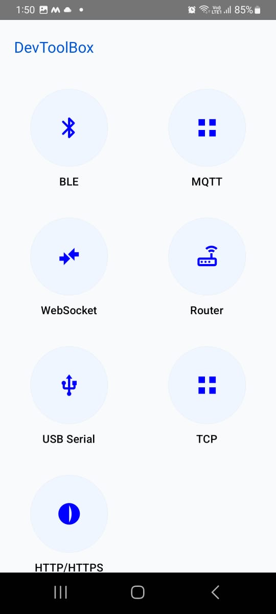

# 🧰 IoT Dev Toolbox

A powerful Android application designed for developers and engineers to **test, debug, and interact with IoT hardware devices** using multiple communication protocols — all in one place.

---

## 📸 Screenshots

<p align="center">
  
  
</p>

## 🚀 Features

### 📡 Communication Protocol Support

* 🔌 **USB** – Test and communicate with USB-based devices
* 🌐 **HTTP** – Send requests and test REST APIs
* 📶 **MQTT** – Publish/Subscribe to IoT brokers
* 🌍 **WebSocket** – Real-time bidirectional communication
* 📡 **BLE (Bluetooth Low Energy)** – Scan, connect, and debug BLE devices
* 📡 **Router Tools** – Network-level testing and diagnostics

---

## 🧪 Use Cases

* 🔧 Test IoT hardware during development
* 📡 Debug communication between devices
* 🔍 Monitor real-time data from sensors
* ⚡ Validate API responses and network behavior
* 🧠 Prototype IoT solutions quickly

---

## 📱 Screens & Modules

* 🔎 BLE Scanner with live terminal logs
* 🌐 HTTP request tester
* 📡 MQTT client (publish & subscribe)
* 🔌 USB communication interface
* 🌍 WebSocket tester
* 🛜 Network / Router utilities

---

## 🏗️ Built With

* **Kotlin**
* **Jetpack Compose**
* **Android SDK**
* **Material 3 UI**

---

## 📦 Installation

1. Clone the repository:

   ```bash
   git clone https://github.com/YOUR_USERNAME/YOUR_REPO.git
   ```

2. Open in **Android Studio**

3. Build & Run on your device 🚀

---

## ⚙️ Requirements

* Android 8.0+ (API 26+)
* Bluetooth (for BLE features)
* Internet connection (for network tools)

---

## 🧠 Future Improvements

* 📊 Advanced BLE analytics
* 📁 Export logs (CSV / JSON)
* 🔐 Secure MQTT (TLS support)
* 📡 Signal strength visualization
* 🧪 Automated test scripts

---

## 🤝 Contributing

Contributions are welcome!
Feel free to open issues or submit pull requests.

---

## 📄 License

This project is licensed under the MIT License.

---

## 👨‍💻 Author

Developed with ❤️ for IoT developers and testers.

---
